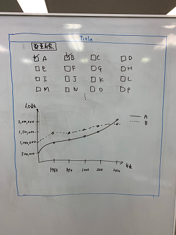

# JPopulation (Demo app)

[](https://opensource.org/licenses/MIT)

都道府県別の総人口推移グラフを表示するSPA

## 内容

1. RESAS(地域経済分析システム) APIの「都道府県一覧」APIから取得する
2. APIレスポンスから都道府県一覧のチェックボックスを動的に生成する
3. 都道府県にチェックを入れると、RESAS APIから選択された都道府県の「人口構成」を取得する
4. 人口構成APIレスポンスから、X軸:年、Y軸:人口数の折れ線グラフを動的に生成して表示する
    1. 「総人口」の他に「年少人口」「生産年齢人口」「老年人口」も切り替えるUIを何らかの形で用意し表示できるようにすること（同時に表示する必要はない）

## Design

### Wireframe

[](meta/images/wireframe.png)

## インストール

```sh
git clone https://github.com/allusernamestakenexceptthis/jpopulation
cd jpopulation
npm install
npm run dev
```

## コマンド

### Lint

Eslintでコードの構文チェックする

```sh
npm run lint
```

Eslintでコードの構文チェックして直す

```sh
npm run lint:fix
```

### Format

Prettierでコードの整形をきれいにする

```sh
npm run format
```

### Fix

Prettierでコードの整形をきれいにして、Eslintでコードの構文チェックして直します

```sh
npm run fix
```
